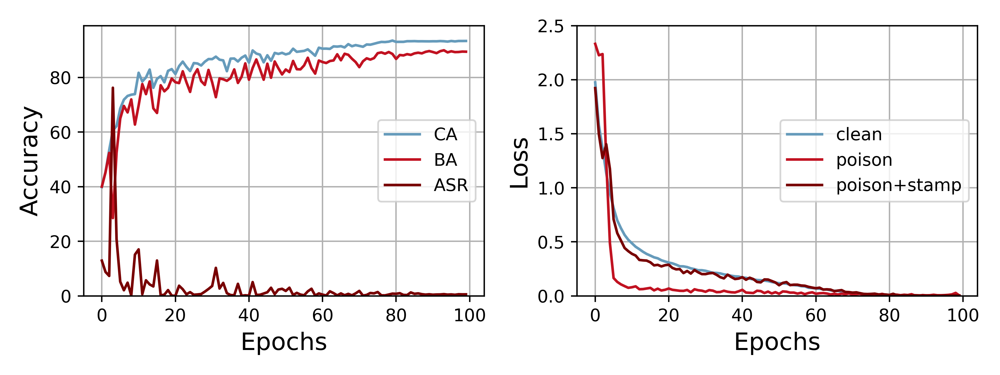

This is the implementation of "Beating Backdoor Attack at Its Own Game" (ICCV-23). \[[arXiv](https://arxiv.org/abs/2307.15539)\]

The defense framework injects a non-adversarial backdoor to suppress the effectiveness of backdoor attack.

# Installation
```bash
pip install -r requirements.txt
```

# Quick Demonstration
Run the following command for a quick demonstration.
```bash
bash quick_demo.sh badnets
```
We provide demonstrations for "badnets" and "blend" attack. The script generates a poisoned dataset saved under `datasets/cifar10/`, and train a model with NAB on it. Detected samples and pseudo labels can be found in `isolation/` and `pseudo_label/`, respectively.

# Steps to Implement NAB
## 1. Data Preprocessing
All datasets should be organized as a dictionary saved under `./CIFAR10/${attack}/`:
```
{"data": FloatTensor, "labels": LongTensor, "true_labels": LongTensor, "backdoor": BoolTensor, "target": int}
```

You can obtain a formatted CIFAR-10 dataset with `scripts/create_cifar10.sh` and poison it with `scripts/poison.py`:

```bash
bash scripts/create_cifar10.sh
python scripts/poison.py \
    --data cifar10 --attack badnets \
    --ratio 0.1 --target 0
```

## 2. Backdoor Detection
We provide the implementation of [LGA](https://github.com/bboylyg/ABL) here:
```bash
python backdoor_detection_lga.py --attack badnets10
```
The results are stored under `isolation/`. You can also replace LGA with other methods:

* [SPECTRE](https://github.com/SewoongLab/spectre-defense)
* [Label-Noise Learning (DBD)](https://github.com/SCLBD/DBD)
* Any other detection method that can isolate a small set of suspected samples.

## 3. Pseudo Label
We provide the implementation of VD:
```bash
python scripts/create_clean_lite.py
python pseudo_label_vd.py --attack badnets10
```
If you also experiment with a defense method using self-supervised learning like [DBD](https://github.com/SCLBD/DBD), we recommend Nearest-Center (NC) in our paper for higher pseudo label quality.

## 4. Train with NAB
NAB is a data preprocessing framework. To avoid extra storage overhead, we provide a on-the-fly implemetation where detected samples are processed during each training update.

```bash
python train_nab.py \
    --attack badnets10 \
    --isolation ${detection_results} \
    --pseudo-label ${pseudo_labels}
```

## 5. Test Data Filtering
You can augment NAB with a simple test data filtering technique:
```bash
python evaluate_filter.py \
    --attack badnets10 --checkpoint ${checkpoint}
```

# Training Process Visualization
NAB with LGA and NC under BadNets attack.



# Citation
Please consider citing our paper if your find our research or this codebase helpful:
```
@inproceedings{liu2023beating,
  title={Beating Backdoor Attack at Its Own Game},
  author={Liu, Min and Sangiovanni-Vincentelli, Alberto and Yue, Xiangyu},
  booktitle={Proceedings of the IEEE/CVF International Conference on Computer Vision},
  pages={4620--4629},
  year={2023}
}
```
